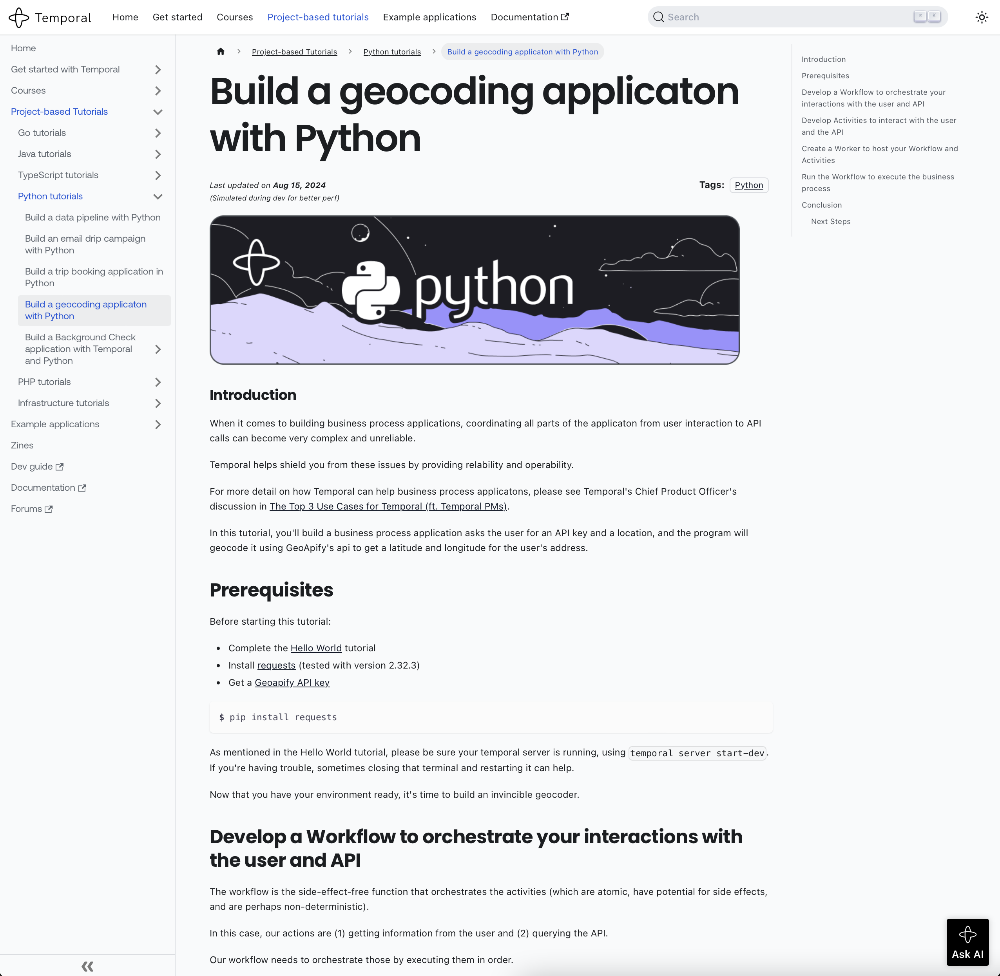

This is a tutorial to display some of Temporal's functionality.
Specifically it is a business process application, that is part
of the Python Project-Based Tutorial Series.  In this series,
each tutorial has (1) a repository in [Temporal organization](https://github.com/temporalio) that holds the code, and (2) a narrative
tutorial that goes with the code -- all of live in a single repository.

Some examples of the other code repositories in the series are the following:

- https://github.com/temporalio/data-pipeline-project-python
- https://github.com/temporalio/email-subscription-project-python

Hopefully this repository can be moved to the [Temporal organization](https://github.com/temporalio) as well
and be housed alongside these others.

And the narrative tutorial will hopefully be a part of the single repository
that holds all the other narrative tutorials, but for now it is in a fork at
[geocoding tutorial](https://github.com/GSmithApps/temporal-learning/tree/project-based-tutorial-python/docs/tutorials/python)
and has a [draft PR](https://github.com/temporalio/temporal-learning/pull/295).

The tutorial, when rendered, looks like

